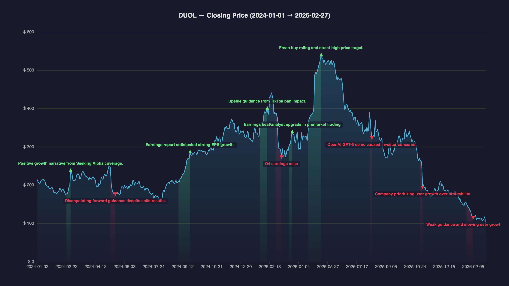

# stonk-chart 📈

> Self-contained interactive HTML stock charts annotated with real-world events and LLM summaries.

**[▶ Live Demo — DUOL 2024–2026](https://0xdv.github.io/stonk-chart/)**

---

## What it does

1. Downloads OHLCV data via **yfinance** (no API key needed)
2. Detects the biggest consecutive price moves above your threshold
3. Searches **Google News** for news around each move
4. Summarises the cause in ≤10 words using a **free LLM** (g4f)
5. Renders a dark-themed **ECharts** line chart with annotated markers and rich tooltips
6. Outputs a single **self-contained `.html`** file — no server, just open in browser



---

## Usage

```bash
pip install -r requirements.txt

# Basic — last year of AAPL, annotate moves ≥5%
python chart.py AAPL

# Custom range and threshold
python chart.py TSLA --start 2023-01-01 --end 2024-01-01 --min-pct 10

# Top 5 biggest moves only
python chart.py NVDA --min-pct 5 --top 5

# Skip slow news/LLM step
python chart.py MSFT --no-news

# Save to a custom file
python chart.py AMZN --output amzn.html --no-open
```

### All options

| Flag | Default | Description |
|------|---------|-------------|
| `ticker` | `AAPL` | Stock ticker symbol |
| `--start` / `-s` | 1 year ago | Start date `YYYY-MM-DD` |
| `--end` / `-e` | today | End date `YYYY-MM-DD` |
| `--min-pct` / `-p` | `5.0` | Minimum absolute % move to annotate |
| `--top` / `-n` | all | Cap number of annotations |
| `--output` / `-o` | `chart.html` | Output HTML path |
| `--no-news` | — | Skip Google News search & LLM |
| `--no-open` | — | Don't auto-open in browser |
| `--clear-cache` | — | Delete cached data before running |

---

## Install

```bash
git clone https://github.com/0xdv/stonk-chart
cd stonk-chart
pip install -r requirements.txt
python chart.py AAPL
```

**requirements.txt**
```
yfinance
pandas
g4f
```

> **Note:** `g4f` uses free/unofficial GPT endpoints. If LLM calls fail, the chart still renders with Google News headlines as-is. Pass `--no-news` for fast offline-only mode.

---

## How it works

```
yfinance  →  price DataFrame
                ↓
         find_extreme_moves()   ← consecutive same-direction streaks ≥ min_pct%
                ↓
         annotate_events()      ← Google News + g4f one-line summary
                ↓
         HTML_TEMPLATE          ← ECharts markPoint markers + rich tooltips
                ↓
         chart.html             ← open in browser
```

Results are cached under `cache/` so repeated runs are instant:
- `cache/{TICKER}_{start}_{end}.csv` — price data
- `cache/{TICKER}_annotations.json` — news + LLM summaries

---

## Project structure

```
stonk-chart/
├── chart.py        # CLI entry point + chart builder
├── data.py         # yfinance download + extreme-move detection
├── news.py         # Google News search + g4f LLM summarisation
├── cache.py        # two-layer file cache (prices + annotations)
├── template.py     # ECharts HTML template
└── requirements.txt
```

---

## License

MIT
